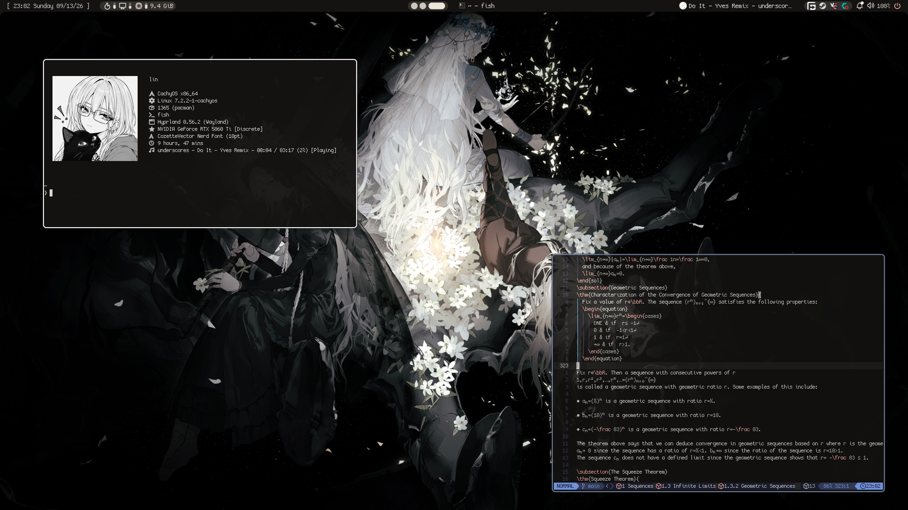

# dotfiles
Dotfiles for my current linux setup. Updated when I remember to
## screenshot

### config stuff
- os: cachy
- de: hyprland
- hyprland shell: noctalia
- font: cozette
- terminal: alacritty
- shell: fish
